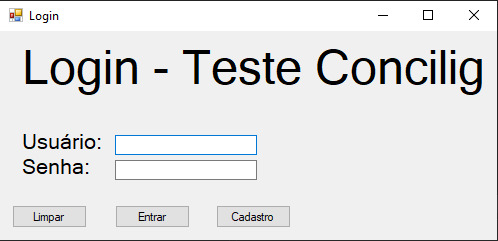
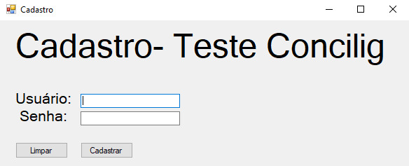
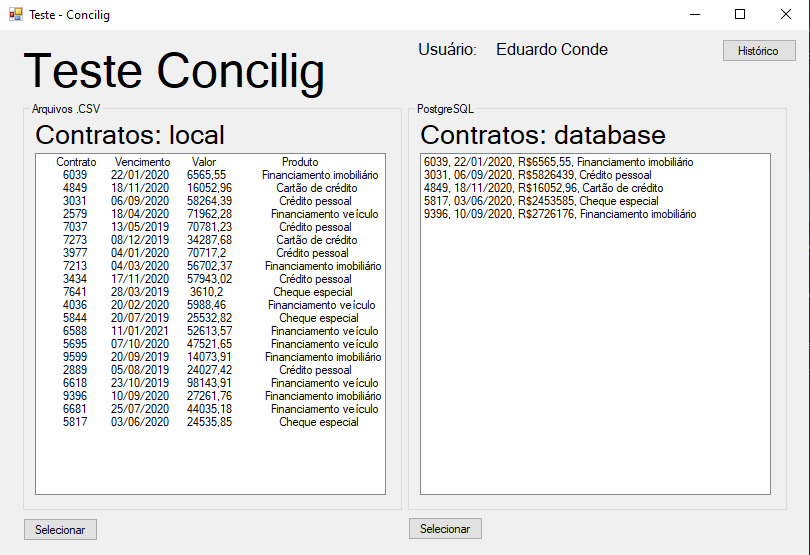
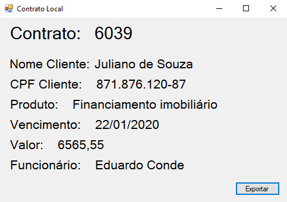
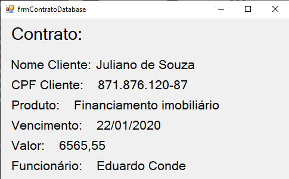
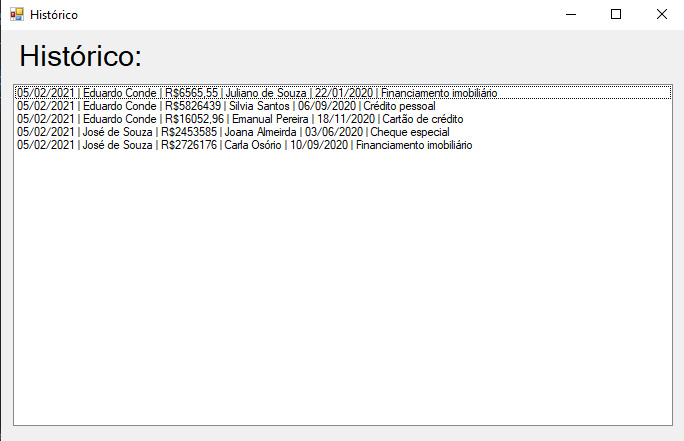

# Apresentação Teste-Concilig

O projeto é um teste que faz parte do processo seletivo para uma vaga na empresa Concilig. 

A proposta foi o desenvolvimento de um programa (utilizando qualquer tecnologia) para a leitura de dados de um arquivo *.csv* e gravação de seus dados em um Banco de dados.

## Apresentação do Sistema de desenvolvido
### Tecnologias: 
- Foi escolhida a linguagem C# para o desenvolvimento do projeto;
- Foi utilizado o banco de dados PostgreSQL;
- Para a interação de ambos foi utilizado o pacote de bibliotecas NpgSql;

### Funcionamento:
#### Login

- O Login é uma tela comum, com três botões intuitivos. Sobre suas funções:
  - **Limpar**: responsável por limpar as Caixas de Texto onde o usuário insere seus dados;
  - **Entrar**: realiza o teste do login para a entrada no sistema;
  - **Cadastro**: abre um novo form para cadastro de novos funcionários;

#### Cadastro

- O cadastro também é uma tela comum, com os campos de inserção dos dados requisitados e botões de limpeza dos campos e cadastro no sistema.

#### Tela Principal

- A tela principal do sistema é dividida em partes:
  - Do lado esquerdo temos dados provenientes do arquivo .csv fornecido, assim como um botão para a melhor visualização de cada contrato;
  - O botão selecionar, abaixo da primeira lista, fornece a seguinte tela: 
  - 
  - Ao lado direito temos dados provenientes do banco de dados, de contratos que já tiveram seus dados exportados. Neste caso, também temos um botão para a visualização detalhada de contratos, na seguinte tela: 
  - 
  - No canto esquerdo superior está o botão *Histórico*, que encaminha para uma tela onde é possível ver todas as exportações realizadas, e quais os funcionários responsáveis por cada uma:
  - 
